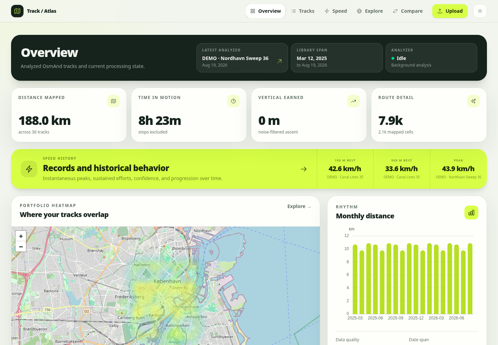
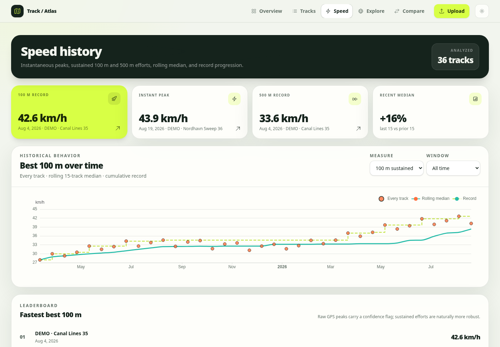
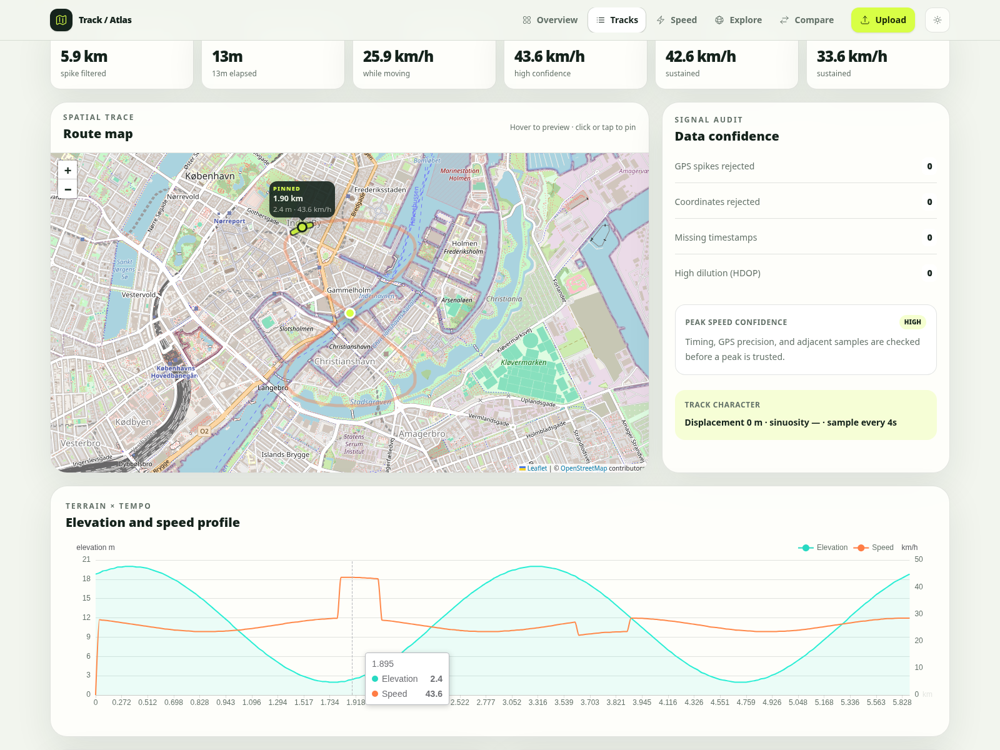
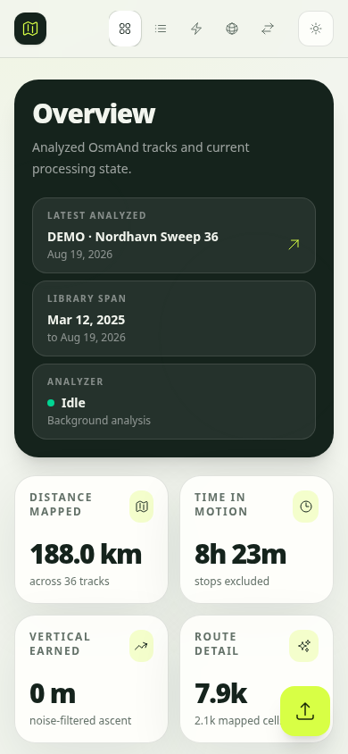
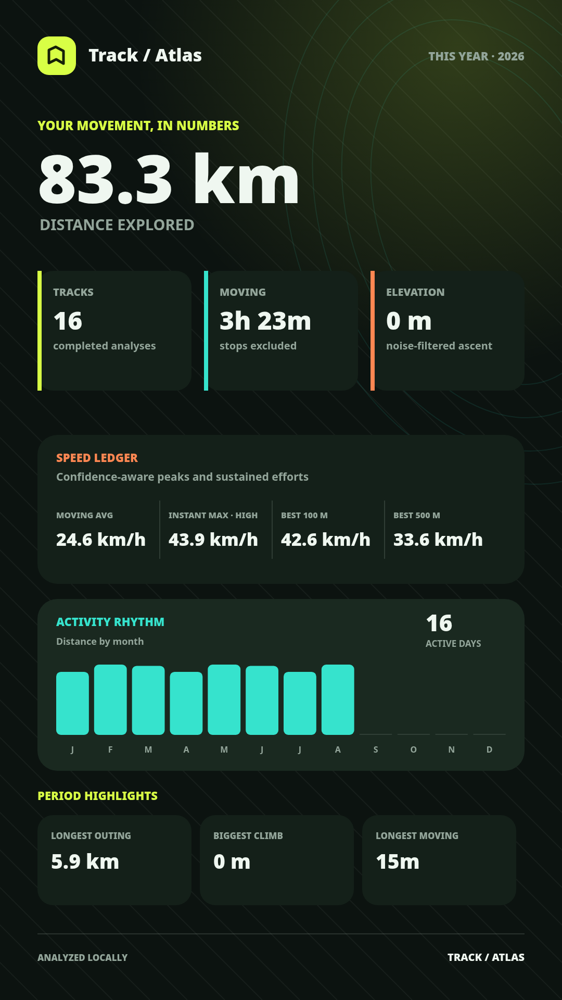

# Track / Atlas

Track / Atlas is a self-hosted application for turning an OsmAnd track library into useful maps, trends, records, and activity summaries. Upload an OsmAnd `.osf` export and let the app validate, deduplicate, and analyze its tracks in the background.



<table>
  <tr>
    <td width="50%"></td>
    <td width="50%"></td>
  </tr>
  <tr>
    <td align="center"><strong>Speed history</strong></td>
    <td align="center"><strong>Track detail</strong></td>
  </tr>
  <tr>
    <td width="50%" align="center"></td>
    <td width="50%" align="center"></td>
  </tr>
  <tr>
    <td align="center"><strong>Mobile overview</strong></td>
    <td align="center"><strong>Shareable recap</strong></td>
  </tr>
</table>

## What you can explore

- Distance, elapsed/moving/stopped time, average speed, and confidence-rated maximum speed
- Best sustained 100 m and 500 m speeds, personal records, and track-linked leaderboards
- Speed history with every-track scatter, rolling medians, cumulative records, and time filters
- Elevation gain/loss, elevation range, sustained climbs, stopped periods, and kilometer splits
- Best 100 m, 500 m, 1 km, 5 km, 10 km, 20 km, and 40 km efforts
- Route shape, displacement, sinuosity, loop resemblance, sample cadence, and dominant bearing
- GPS quality checks for implausible spikes, missing observations, invalid coordinates, and high HDOP
- Portfolio totals, monthly rhythm, coverage heatmaps, longest tracks, and four-track comparisons
- Story-sized PNG recaps for all time, the current year, month, or week

Maps and charts use compact precomputed renderings, so the interface stays responsive even with a large library.

## Getting tracks out of OsmAnd

Track / Atlas accepts original OsmAnd `.osf` exports. Loose GPX files are intentionally rejected because the OSF manifest preserves folder structure and makes large imports safer to validate and deduplicate.

On Android:

1. Open **Menu → Settings → Import/export → Export to file**.
2. Select **My Places → Tracks** and choose the folders or tracks you want.
3. Save or share the resulting `.osf` file to the device running Track / Atlas.

On iOS:

1. Open **Menu → Settings → Local backup → Back up as file**.
2. Select **My Places → Tracks** and choose the folders or tracks you want.
3. Save or share the resulting `.osf` file.

See the [OsmAnd import/export guide](https://www.osmand.net/docs/user/personal/import-export/) if the menu labels differ in your version.

## Install and run

You need Elixir 1.17 or newer, a compatible Erlang/OTP release, PostgreSQL, and Node.js/npm.

The development configuration expects PostgreSQL on `localhost` with username and password `postgres`. Adjust `config/dev.exs` if your local credentials differ.

```sh
mix setup
mix phx.server
```

Open [http://localhost:4000](http://localhost:4000), choose **Upload**, and select one or more `.osf` files. A batch can contain up to 25 exports, each as large as 5 GB.

Uploads and analysis continue in the background. You can leave the import screen after each browser upload reaches 100%; progress remains visible on Overview and Import.

## Using the app

- **Overview** shows library totals, current processing, speed records, route coverage, and recent tracks.
- **Tracks** provides the searchable analyzed library and links to every track detail.
- **Speed** focuses on historical maximum and sustained-speed behavior.
- **Explore** shows coverage, overlap, quality, and distance leaders.
- **Compare** places up to four tracks on the same normalized performance view.
- **Create recap** on Overview builds a 1080×1920 PNG for Instagram Stories or WhatsApp Status. Choose All time, This year, This month, or This week, then use the device share sheet or download the image.

Recaps are rendered in the browser and are not stored by Track / Atlas. They contain aggregate values only—no maps, route shapes, coordinates, track names, filenames, or exact activity times.

## Privacy and storage

Track analysis is local to this application. Source archives and extracted tracks live under `TRACK_STORAGE_PATH` (or `var/track_analyzer` in development) and are never served from `priv/static`.

The default Leaflet layer requests ordinary map tiles from OpenStreetMap. Change the map configuration in `config/config.exs` if you prefer a self-hosted tile server.

Track / Atlas currently has no built-in user accounts. Keep it on a trusted machine or private network, or place it behind authentication and HTTPS before exposing it publicly.

## Production configuration

The production runtime requires:

| Variable | Purpose |
| --- | --- |
| `DATABASE_URL` | PostgreSQL connection URL |
| `SECRET_KEY_BASE` | Phoenix signing/encryption secret; generate it with `mix phx.gen.secret` |
| `TRACK_STORAGE_PATH` | Durable writable storage for private OSF and extracted GPX files |
| `PHX_HOST` | Public hostname; defaults to `example.com` |
| `PORT` | HTTP port; defaults to `4000` |

Back up both PostgreSQL and `TRACK_STORAGE_PATH`. The database contains analysis results, while the storage directory contains the source material needed for future reprocessing.

## Reanalyzing older tracks

When a newer analyzer version adds or changes persisted metrics, enqueue only outdated tracks:

```sh
mix track_analyzer.reanalyze --stale
```

Individual tracks can also be reanalyzed from their detail screen.

## Development checks

```sh
mix precommit
mix assets.deploy
```

`mix precommit` compiles with warnings treated as errors, checks formatting, and runs the test suite.
